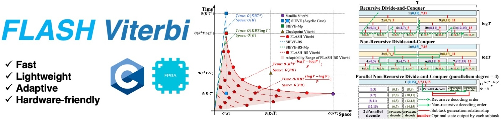

<div align="center">
<h1>FLASH Viterbi: Fast and Adaptive Viterbi Decoding for Modern Data Systems</h1>

</div>
<div align="center">
<b><a href="https://github.com/Dzh-16">Ziheng Deng</a></b><sup>1</sup>,
<b><a href="http://www.cse.neu.edu.cn/2019/0813/c6641a157482/page.htm">Xue Liu</a></b><sup>1</sup>,
<b><a href="https://jjiantong.github.io/">Jiantong Jiang</a></b><sup>2</sup>,
<b>Yankai Li</b><sup>1</sup>,
<b><a href="http://www.neu-rtes.org/~dengqx/">Qingxu Deng</a></b><sup>1</sup>,
<b><a href="https://scholar.google.com/citations?user=zMYeuzMAAAAJ&hl=en">Xiaochun Yang</a></b><sup>1</sup>,
</div>
<div align="center">
<sup>1</sup>Northeastern University, China
<sup>2</sup>The University of Melbourne, Australia
</div>


This repository provides optimized C implementations of Viterbi decoding for Hidden Markov Models (HMMs). The mission is to help practitioners easily and efficiently apply the Viterbi algorithm to solve problems.

🔗 Paper link: <https://arxiv.org/abs/2510.19301>

[**Included Methods**](#included-methods) 
| [**Key Features**](#key-features) 
| [**Implementations**](#implementations) 
| [**Usage**](#usage) 
| [**Data Generation**](#data-generation)
| [**Takeaways**](#takeaways)
| [**Citation**](#citation)


## Included Methods

This repository includes our proposed FLASH VITERBI and its beam search variant FLASH-BS VITERBI. 
1. **FLASH Viterbi** — a full-state-space Viterbi with parallel divide-and-conquer dynamic programming.
2. **FLASH-BS Viterbi** — an extension of the above with dynamic Beam Search pruning for improved efficiency.

It also includes baseline Viterbi algorithms for performance and memory comparisons. All implementations are re-written and optimized in C, which are designed for high-performance execution on Linux/Unix-like environments. The baselines include vanilla Viterbi, checkpoint Viterbi, SIEVE-Mp, SIEVE-BS, and SIEVE-BS-Mp.


## Key Features

Key features of FLASH Viterbi and its variant are as follows.
- *Fast* execution with the help of non-recursive design, pruning, and parallelization.
- *Lightweight* memory usage with the help of non-recursive design, pruning, and parallelization.
- *Adaptive* to diverse development scenarios by dynamically tuning internal paramaters.
- *Hardware-friendly* properties due to non-recursive structures, the elimination of BFS
traversal, and double-buffered memory schemes.


## Implementations

- **POSIX multithreading**: Uses `pthread` for efficient parallel computation.
- **Divide-and-conquer decoding**: Splits the sequence into segments for concurrent computation.
- **Log-domain computation**: Prevents numerical underflow during probability calculations.
- **Performance reporting**: Reports both decoding time and memory consumption after execution.

### FLASH_Viterbi_multithread.c:

- Implements full dynamic programming over the entire state space.
- Uses chunked parallelism for efficient scaling.
- Performs efficient backtracking after decoding.

### FLASH_BS_Viterbi_multithread.c:

- Integrates **dynamic Beam Search** using a min-heap to maintain the top-B paths.
- Reduces both runtime and memory usage when `B << K`.

### Baseline Algorithms

All baseline algorithms were originally available as open-source Python implementations, relying heavily on Python-specific libraries. Since C provides finer-grained control over multi-threading and memory management—**making it more suitable for deployment on resource-constrained edge devices**—we implemented our proposed FLASH Viterbi and FLASH-BS Viterbi in C. For fair comparison, we also re-implemented all baselines in C and verified that their outputs match those of the original Python versions, including:

- **Vanilla Viterbi**: the standard Viterbi algorithm;  
- **Checkpoint Viterbi**: stores intermediate decoding states every $\sqrt{T}$  steps to reduce memory usage; 
- **SIEVE-Mp**: applies recursive divide-and-conquer strategy to reduce memory usage; 
- **SIEVE-BS**: a SIEVE variant with static beam search; 
- **SIEVE-BS-Mp**: a SIEVE-Mp variant with static beam search.

The unified C implementations substantially improve runtime and memory efficiency across all baselines. For example, under the same condition of $K=3965,T=256$, the decoding time of SIEVE-Mp decreased from $1679.8s$ to $672.6s$ ($2.5\times$ speedup), while memory usage was reduced from $127{,}554{,}056B$ to $775{,}044B$ ($164.6\times$ reduction). Similar improvements were consistently observed across other baselines.

We have placed the C implementations of each baseline algorithm in the **Base_line\C implementations** directory. Two execution modes are provided:

1. **Run single code**: You can modify the decoding problem scale and algorithm parameters directly in the code and run it.
2. **Run through Python script**: A Python script is also provided to run multiple algorithms on the same problem for performance comparison.

For detailed instructions, refer to the **README.Usage** section.

In addition, we provide the original Python implementations of the baselines for reference in the **Base_line\Python implementations** directory. All baseline algorithms are integrated into **Baseline.py**, where you can run the code to obtain the time and memory consumption for each algorithm. These metrics are saved in the current folder as a `.txt` file. Due to the complexity of memory usage in the decoding algorithms,  we provide detailed memory consumption, including the memory used by variables during decoding, the memory required for the final output paths, and the maximum memory usage during BFS operations for algorithms involving BFS. 


### Hardware Implementations

In addition to the software-based implementations of the Viterbi algorithm, hardware-accelerated versions are also available. These implementations are written in Verilog and are designed to run on the Vivado 2019.2 platform.

#### 1. `FLASH_BS_viterbi_hw.bit`

Hardware implementation of the basic FLASH Viterbi algorithm, performing full state-space decoding.

#### 2. `FLASH_viterbi_hw.bit`

Hardware implementation of FLASH Viterbi with dynamic Beam Search for faster decoding and lower memory usage.


## Usage

- All programs read data from the `./data/` directory. The files are generated beforehand and follow the naming pattern:

  - `A_K{K}_T{T}_prob{p}.txt` — Transition matrix \(A\)
  - `B_K{K}_T{T}_prob{p}.txt` — Emission matrix \(B\)
  - `Pi_K{K}_T{T}_prob{p}.txt` — Initial state probabilities \(\pi\)
  - `ob_K{K}_T{T}_prob{p}.txt` — Observation sequence

  Here `{T}` corresponds to the observation sequence length (`obserRouteLEN` in the code), and `{p}` denotes the edge probability used during data generation.

### Run through script

A unified Python driver `run.py` is provided to compile, execute, and benchmark all algorithms:

#### Configuration

Edit `run.py` to specify:

- `base_path` — path to C source files.
- `data_path` — path to input data.
- `result_path` — output directory for CSV results.
- `file_names` — list of algorithms to test.
- `parameters` — a list of parameter sets:
  - `K_STATE` — number of states, corresponding to the `{K}` field in the input data file names and matching the \(K\) variable used in the paper.
  - `T_STATE` — observation dimension.
  - `obserRouteLEN` — observation sequence length (number of timesteps), corresponding to the `{T}` field in the input data file names and matching the \(T\) variable used in the paper.
  - `prob` — edge probability for input data.
  - `MAX_THREADS` — number of threads to use.
  - `BeamSearchWidth` — beam width for pruning.

#### Execute

```bash
python3 run.py
```

`run.py` will set each parameter in the array `parameters` for each program in the array `file_names` . The running results will be saved separately by program name to the result_math directory and stored in CSV format. Please place all tested code and `run.by` in the same directory before running.

It should be noted that some parameters are invalid for some programs:

- `parameter['MAX_THREADS']` only works in `FLASH_Viterbi_multithread` and `FLASH_BS_Viterbi_multithread`
- `parameter['BeamSearchWidth']` only works in `FLASH_BS_Viterbi_multithread` ,  `SIEVE-BS` and `SIEVE-BS-Mp`

### Run single code

1. Set the parameters in the original file to the values of the data you want to test
2. Use the following command to compile and run the specified file for the corresponding code:

```bash
gcc -g -pthread FLASH_Viterbi_multithread.c -o FLASH_Viterbi_multithread -lm
./FLASH_Viterbi_multithread
```

```bash
gcc -g -pthread FLASH_BS_Viterbi_multithread.c -o FLASH_BS_Viterbi_multithread -lm
./FLASH_BS_Viterbi_multithread
```

```bash
gcc -g -pthread 'vanilla Viterbi.c' -o 'vanilla Viterbi' -lm
'./vanilla Viterbi'
```

```bash
gcc -g -pthread 'checkpoint Viterbi.c' -o 'checkpoint Viterbi' -lm
'./checkpoint Viterbi'
```

```bash
gcc -g -pthread SIEVE-Mp.c -o SIEVE-Mp -lm
./SIEVE-Mp
```

```bash
gcc -g -pthread SIEVE-BS.c `pkg-config --cflags --libs glib-2.0` -o SIEVE-BS -lm
./SIEVE-BS
```

```bash
gcc -g -pthread SIEVE-BS-Mp.c `pkg-config --cflags --libs glib-2.0` -o SIEVE-BS-Mp -lm
./SIEVE-BS-Mp
```

In cases the data size of the Transition matrix and Emission matrix is too large, the stack size should be specified during program compilation, such as by adding '-Wl,-z,stack-size=268435456' at the end of the compilation command.


## Data Generation

You can use the following scripts to generate synthetic datasets for testing the Viterbi implementations:

### 1. `data_script.py`: Random Sparse Graph-Based HMM

This script generates transition (`A`), emission (`B`), initial probability (`Pi`), and observation (`ob`) files using a sparse random graph.

**Usage:**

```bash
python data_script.py -s <seed> -n <n_ob> -K <K> -T <T> -b <beam_width> -p <prob>
```

**Arguments:**

- `-s`: Random seed
- `-n`: Number of distinct observation symbols
- `-K`: Number of hidden states
- `-T`: Length of observation sequence
- `-b`: Beam width (for reference logging)
- `-p`: Probability of edge existence between states

**Output Files:**

- `A_K{K}_T{T}_prob{prob}.txt` – Transition matrix
- `B_K{K}_T{T}_prob{prob}.txt` – Emission matrix
- `Pi_K{K}_T{T}_prob{prob}.txt` – Initial state probabilities
- `ob_K{K}_T{T}_prob{prob}.txt` – Observation sequence

---

### 2. `data_script_dag.py`: DAG-Based Transition Structure

This script constructs a directed acyclic graph (DAG) as the HMM transition structure for testing topologically ordered models.

**Usage:**

```bash
python data_script_dag.py -s <seed> -n <n_ob> -K <K> -T <T>
```

**Arguments:**

- `-s`: Random seed
- `-n`: Number of distinct observation symbols
- `-K`: Number of hidden states
- `-T`: Length of observation sequence

**Output Files:**

- `A_K{K}_T{T}_DAG.txt` – Transition matrix from a DAG
- `B_K{K}_T{T}_DAG.txt` – Emission matrix
- `Pi_K{K}_T{T}_DAG.txt` – Initial state probabilities
- `ob_K{K}_T{T}_DAG.txt` – Observation sequence


## Takeaways

- The FLASH_BS_Viterbi implementation is more memory-efficient for large state spaces
- The FLASH_Viterbi implementation may be faster for small state spaces
- Actual performance depends on observation sequence length and available cores


## Citation

If you find FLASH Viterbi useful, please consider citing our paper.
```
@inproceedings{deng2026flash,
  title={FLASH Viterbi: Fast and Adaptive Viterbi Decoding for Modern Data Systems},
  author={Deng, Ziheng and Liu, Xue and Jiang, Jiantong and Li, Yankai and Deng, Qingxu and Yang, Xiaochun},
  booktitle={IEEE International Conference on Data Engineering (ICDE)},
  year={2026},
}
```
